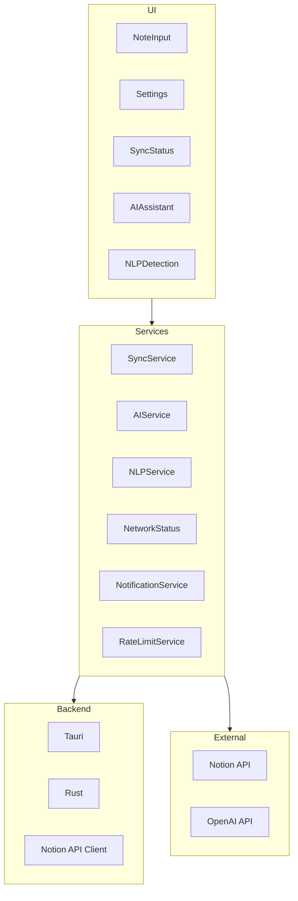
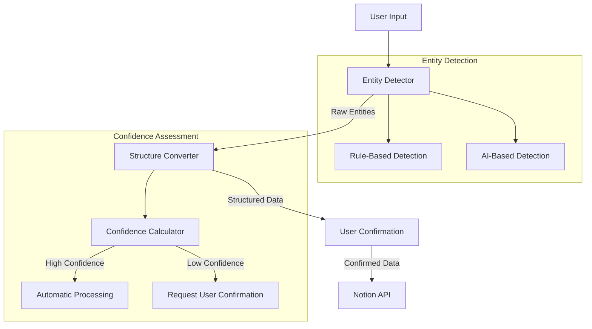

# System Patterns

This document outlines the key technical decisions, design patterns, and architectural approaches used in the Notion Quick Notes application.

## High-Level Architecture



## Key Design Patterns

### Singleton Services

Most services (SyncService, AIService, NLPService, etc.) are implemented as singletons to ensure consistent state across the application. Each service exposes a `getXService()` function that either creates a new instance if one doesn't exist or returns the existing instance.

```typescript
// Example singleton pattern
let serviceInstance: Service | null = null;

export function getService(): Service {
  if (!serviceInstance) {
    serviceInstance = new Service();
  }
  return serviceInstance;
}
```

### Observer Pattern

The application uses the observer pattern for event notifications, particularly for system events like network status changes, rate limit updates, and sync status updates. Components can subscribe to these events to update their state accordingly.

```typescript
// Example observer pattern
class EventEmitter {
  private listeners: Map<string, Function[]> = new Map();
  
  addListener(event: string, callback: Function): void {
    if (!this.listeners.has(event)) {
      this.listeners.set(event, []);
    }
    this.listeners.get(event)!.push(callback);
  }
  
  removeListener(event: string, callback: Function): void {
    // Implementation
  }
  
  emit(event: string, ...args: any[]): void {
    const callbacks = this.listeners.get(event) || [];
    callbacks.forEach(callback => callback(...args));
  }
}
```

### Factory Pattern

The AIService and NLPService use factory methods to create instances with specific configurations or to provide different implementations based on the context (e.g., online vs. offline modes).

### Strategy Pattern

The NLP service uses the strategy pattern to select between different entity extraction methods. Currently, it supports rule-based extraction and has placeholders for AI-based extraction.

## Natural Language Processing System

The NLP system is composed of several components that work together to extract structured information from natural language input.



### Entity Extraction

The entity extraction process uses a combination of rule-based pattern matching and (optionally) AI-based extraction:

1. **Rule-Based Extraction**:
   - Regular expressions for dates, times, and common patterns
   - Keyword matching for actions and priorities
   - Context-aware detection (e.g., recognizing "tomorrow" relative to the current date)

2. **AI-Based Extraction** (future enhancement):
   - Integration with OpenAI for complex natural language understanding
   - Fallback mechanism when rule-based detection has low confidence

### Confidence Scoring

Each detected entity is assigned a confidence score based on:
- Pattern match quality
- Context relevance
- Extracted information completeness

The system uses weighted averaging of entity confidences to calculate an overall confidence score for processing the input.

### Structured Data Conversion

Extracted entities are converted to a structured format suitable for Notion database integration:
- Dates and times are normalized to ISO 8601 format
- Actions are mapped to specific database fields
- Priorities are mapped to predetermined levels (high, medium, low)

## User Interface Components

### Reactive Components

React components are designed to be reactive to state changes, using hooks like useState and useEffect to manage component lifecycle and state updates.

### Component Composition

The UI is built using a composition pattern, where smaller, focused components are composed to build more complex interfaces.

### Memoization

Performance-sensitive components use React.memo to prevent unnecessary re-renders when props haven't changed.

```typescript
// Example memoization pattern
const MemoizedComponent = React.memo(Component);
```

## State Management

The application uses a combination of local component state (useState), context APIs, and singleton services to manage state:

- **Local State**: UI-specific state that doesn't need to be shared
- **Service State**: Application-wide state managed by singleton services
- **Context**: Shared state needed across component hierarchies

## Error Handling

The application implements a centralized error handling system with standardized error objects:

```typescript
interface ErrorResponse {
  code: string;
  message: string;
  user_message: string;
  details?: string;
  recovery_action: 'Retry' | 'RetryLater' | 'OpenSettings' | 'CheckConnection' | 'CheckPageAccess' | 'Restart' | 'None';
  severity: 'Info' | 'Warning' | 'Error' | 'Critical';
}
```

This standardized approach ensures consistent error presentation and recovery options throughout the application.

## Offline Support

The application uses a queue-based system for offline operations:

1. When offline, operations are added to a persistent queue
2. The queue is processed when connectivity is restored
3. Retry mechanisms with exponential backoff handle failed operations

## Integration Patterns

### Notion API Integration

The application uses a Rust-based client for Notion API communication, providing:

- API token management
- Rate limit handling
- Error normalization
- Response parsing

### OpenAI Integration

The AI service integrates with OpenAI via their official SDK, with:

- Configurable models and parameters
- Fallback mechanisms for service disruptions
- Local caching to reduce API usage