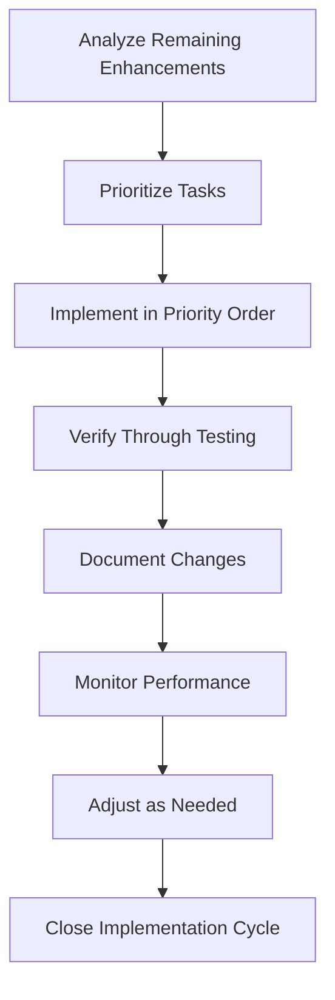
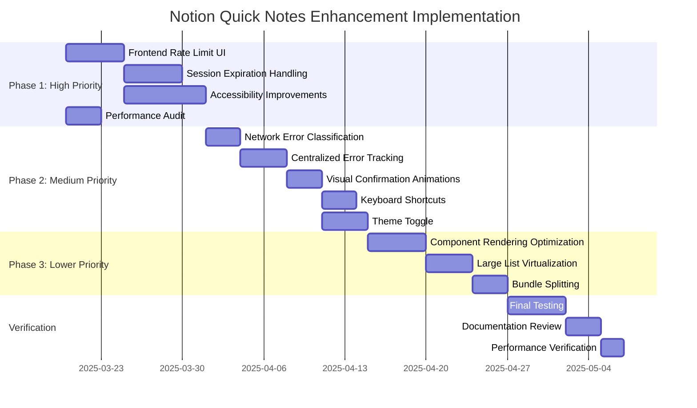

# Notion Quick Notes - Implementation Roadmap

## Strategic Implementation Approach

This document outlines a systematic, methodical approach to implementing the remaining enhancements for Notion Quick Notes, with clear priorities, verification steps, and success metrics.

## Priority Matrix

Tasks are prioritized based on:
1. **Impact**: How significantly the enhancement improves user experience
2. **Dependency**: Whether other enhancements depend on this one
3. **Complexity**: Implementation difficulty and potential risks
4. **Strategic value**: Alignment with product vision

| Enhancement | Impact | Dependency | Complexity | Priority |
|-------------|--------|------------|------------|----------|
| Frontend Rate Limit UI | High | Low | Medium | P1 |
| Session Expiration Handling | High | Low | Medium | P1 |
| Network Error Classification | Medium | Low | Low | P2 |
| Error Tracking System | Medium | Medium | Medium | P2 |
| Visual Confirmation Animations | Medium | Low | Low | P2 |
| Keyboard Shortcuts | Medium | Low | Low | P2 |
| Theme Toggle | Medium | Low | Medium | P2 |
| Accessibility Improvements | High | Low | Medium | P1 |
| Performance Audit | High | High | Low | P1 |
| Component Rendering Optimization | Medium | Medium | Medium | P2 |
| Large List Virtualization | Medium | Low | Medium | P2 |
| Bundle Splitting | Low | Low | Medium | P3 |

## Phase 1: High-Priority Tasks (2 weeks)

### 1.1 Frontend Rate Limit UI
**Goal**: Create visual indicators and controls for API rate limits
**Implementation Steps**:
1. Create a `RateLimitIndicator` component with:
   - Progress bar showing remaining API quota
   - Warning indicators when approaching limits
   - Status text with numerical representation
2. Implement a `RateLimitNotification` system:
   - Toast notifications for rate limit events
   - Action buttons for user response
3. Add a Rate Limit section to Settings with:
   - Display of current limits and usage
   - Auto-throttling configuration options
   - Background request priority settings

**Verification**: 
- UI correctly displays rate limit status in all states
- Notifications appear at appropriate thresholds
- Settings persist user preferences correctly

### 1.2 Session Expiration Handling
**Goal**: Implement token refresh and graceful session management
**Implementation Steps**:
1. Create a token lifecycle manager to:
   - Track token expiration time
   - Proactively refresh before expiration
   - Handle refresh failures appropriately
2. Implement session recovery flow:
   - Detect authentication errors
   - Prompt user for re-authentication when needed
   - Preserve pending operations during re-authentication
3. Add session status indicators in UI

**Verification**:
- Application correctly handles token expiration
- User work is preserved during authentication issues
- Clear feedback is provided during authentication flows

### 1.3 Accessibility Improvements
**Goal**: Make the application fully accessible to all users
**Implementation Steps**:
1. Audit application with accessibility tools
2. Add proper ARIA attributes throughout the application
3. Implement keyboard navigation for all functions
4. Ensure proper contrast ratios for all UI elements
5. Add screen reader support with descriptive labels

**Verification**:
- Pass automated accessibility checks (Lighthouse, axe)
- Test with screen readers and keyboard-only navigation
- Verify color contrast meets WCAG AA standards

### 1.4 Performance Audit
**Goal**: Identify and document all performance bottlenecks
**Implementation Steps**:
1. Measure baseline performance metrics:
   - Initial load time
   - Time to interactive
   - Input latency
   - Memory usage
2. Profile application on different devices
3. Document all performance bottlenecks
4. Create prioritized optimization plan

**Verification**:
- Comprehensive performance report with metrics
- Clear prioritization of performance issues
- Documented baseline for future comparison

## Phase 2: Medium-Priority Tasks (2 weeks)

### 2.1 Enhanced Network Error Classification
**Goal**: Provide more specific error handling for network issues
**Implementation Steps**:
1. Expand network error classification to identify:
   - DNS resolution errors
   - Connection timeout errors
   - Server response timeouts
   - TLS/SSL errors
   - Proxy/firewall issues
2. Enhance error messages with contextual information
3. Implement custom recovery strategies for each error type

**Verification**:
- All network error types are correctly identified
- Error messages are clear and actionable
- Recovery strategies work as expected

### 2.2 Centralized Error Tracking
**Goal**: Create a centralized system for error logging and analysis
**Implementation Steps**:
1. Implement centralized error logger with:
   - Error categorization
   - Context collection
   - Frequency tracking
   - User impact assessment
2. Create an error dashboard in the settings
3. Add analytics for error patterns and solutions

**Verification**:
- All errors are properly logged and categorized
- Dashboard displays accurate error information
- Analytics provide useful insights for troubleshooting

### 2.3 Visual Confirmation Animations
**Goal**: Add visual feedback for user actions
**Implementation Steps**:
1. Design and implement:
   - Note submission success animation
   - Error state animations
   - Loading state animations
   - Transition animations between states
2. Ensure animations are subtle and non-disruptive
3. Make animations configurable in settings

**Verification**:
- Animations trigger at appropriate times
- Animations enhance rather than hinder UX
- Performance impact is negligible

### 2.4 Keyboard Shortcuts
**Goal**: Implement comprehensive keyboard shortcuts for power users
**Implementation Steps**:
1. Design a keyboard shortcut system with:
   - Application-wide shortcuts
   - Context-specific shortcuts
   - Customizable key bindings
2. Add a keyboard shortcut reference screen
3. Implement shortcut conflict detection

**Verification**:
- All shortcuts work as expected in various contexts
- Shortcut customization persists correctly
- Shortcut reference is clear and accessible

### 2.5 Theme Toggle
**Goal**: Implement dark/light theme with system preference detection
**Implementation Steps**:
1. Create a theming system with:
   - CSS variables for all theme properties
   - Dark and light theme definitions
   - System preference detection
   - Manual override option
2. Implement smooth theme transitions
3. Add theme customization options

**Verification**:
- Themes apply correctly throughout the application
- System preference detection works correctly
- Theme transitions are smooth and non-disruptive

## Phase 3: Lower-Priority Tasks (2 weeks)

### 3.1 React Component Rendering Optimization
**Goal**: Optimize rendering performance of React components
**Implementation Steps**:
1. Identify components with unnecessary re-renders
2. Implement proper memoization with:
   - React.memo for functional components
   - useCallback for event handlers
   - useMemo for derived state
3. Optimize state management to reduce render cascades
4. Add render performance monitoring

**Verification**:
- Measure and document rendering performance improvements
- Verify no regression in functionality
- Ensure optimizations work across all supported browsers

### 3.2 Large List Virtualization
**Goal**: Implement virtualization for large data sets
**Implementation Steps**:
1. Implement virtualization for:
   - Page lists in settings
   - Note history views
   - Any other list components
2. Ensure smooth scrolling and proper keyboard navigation
3. Add placeholders for off-screen items

**Verification**:
- Lists handle large datasets without performance degradation
- Scrolling is smooth with minimal jank
- Keyboard navigation works correctly with virtualized lists

### 3.3 Bundle Splitting
**Goal**: Optimize application load time through bundle splitting
**Implementation Steps**:
1. Analyze bundle size and composition
2. Implement code splitting strategies:
   - Route-based splitting
   - Component-based splitting
   - Dynamic imports for infrequently used features
3. Add loading indicators for async chunks

**Verification**:
- Initial bundle size is reduced
- Application loads faster on all tested devices
- Lazy-loaded chunks load without UX disruption

## Testing Methodology

Each enhancement will undergo a rigorous testing process:

1. **Unit Testing**:
   - Test individual components and functions
   - Verify edge cases and error handling
   - Ensure type safety and proper interfaces

2. **Integration Testing**:
   - Test interactions between components
   - Verify data flow and state management
   - Test API integrations with mocks

3. **End-to-End Testing**:
   - Test complete user flows
   - Verify behavior across different environments
   - Test on multiple device types and screen sizes

4. **Performance Testing**:
   - Measure performance impact of changes
   - Test with different resource constraints
   - Verify no regression in key metrics

5. **Accessibility Testing**:
   - Verify WCAG compliance
   - Test with screen readers
   - Test keyboard navigation

## Documentation Requirements

For each enhancement, the following documentation will be created or updated:

1. **Code Documentation**:
   - Inline code comments for complex logic
   - Function/method documentation
   - Architecture documentation for complex features

2. **User Documentation**:
   - Usage instructions for new features
   - Tips for optimal use
   - Troubleshooting guidance

3. **Development Documentation**:
   - Implementation details
   - Design decisions and rationale
   - Future enhancement possibilities

## Tracking and Monitoring

Progress will be tracked using:

1. **Milestone Tracking**:
   - Clear milestones for each phase
   - Regular status updates
   - Dependency tracking

2. **Performance Monitoring**:
   - Baseline performance metrics
   - Regular performance testing
   - Performance regression detection

3. **Error Monitoring**:
   - Error frequency tracking
   - User impact assessment
   - Resolution time metrics

## Implementation Timeline

## Success Metrics

The following metrics will be used to evaluate the success of the implementation:

1. **User Experience Metrics**:
   - Task completion time
   - Error frequency
   - User satisfaction ratings

2. **Performance Metrics**:
   - Initial load time improvement
   - Input latency reduction
   - Memory usage optimization

3. **Code Quality Metrics**:
   - Test coverage
   - Static analysis results
   - Documentation completeness

4. **Accessibility Metrics**:
   - WCAG compliance score
   - Screen reader compatibility
   - Keyboard navigation completeness

## Conclusion

This implementation plan provides a comprehensive, systematic approach to completing all remaining enhancements for Notion Quick Notes. By following this structured methodology, we will ensure that:

1. All changes are implemented in a logical, prioritized order
2. Each enhancement is thoroughly tested and verified
3. Documentation is complete and accurate
4. Performance and quality are maintained throughout
5. The resulting application meets all specified requirements

Regular progress updates will be provided throughout the implementation process, with opportunities for feedback and adjustment as needed.