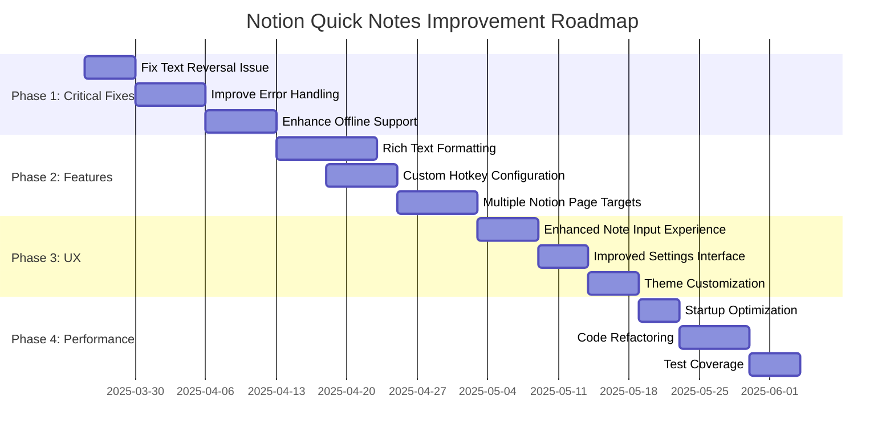
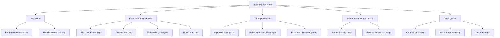
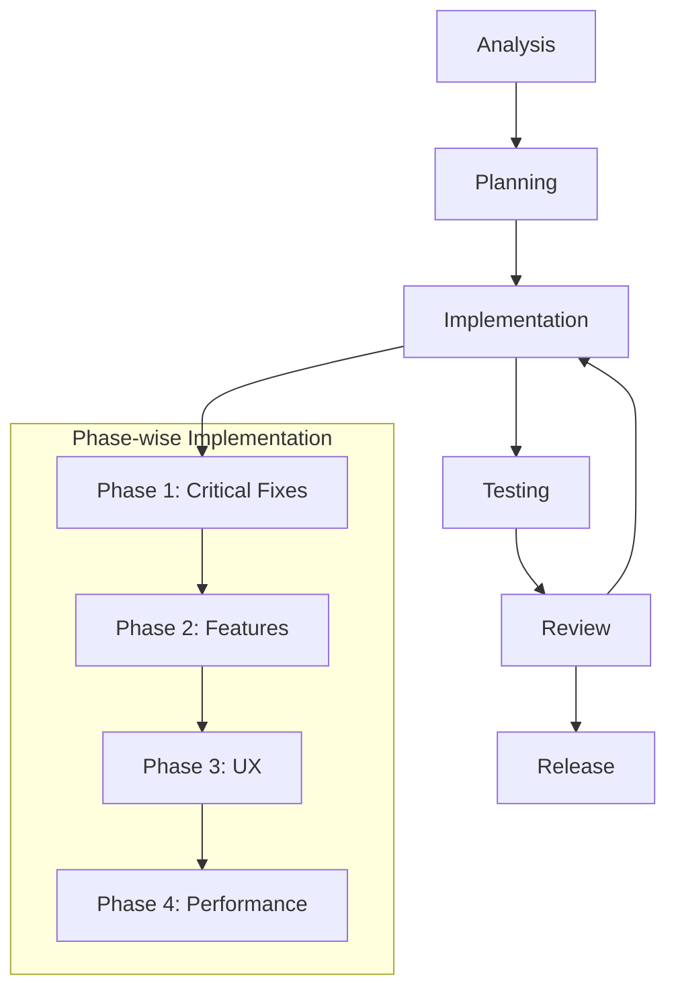

# Notion Quick Notes - Improvement Plan

## Overview

Notion Quick Notes is a lightweight Windows desktop application built with Tauri (Rust + React) that allows users to quickly capture notes with a global hotkey (ALT+Q) and send them to a selected Notion page with a timestamp. After analyzing the codebase, this document outlines a comprehensive improvement plan spanning bug fixes, feature enhancements, UX improvements, and performance optimizations.

## Current State Analysis

The application currently provides these core functionalities:
- Global hotkey (ALT+Q) to capture notes from anywhere
- Minimalist note input interface
- Notion API integration for authentication and note appending
- System tray operation with settings access
- Basic dark mode support

Several areas for improvement have been identified, organized into four phases of implementation.

## Implementation Roadmap



## Improvement Areas



## Phase 1: Critical Bug Fixes & Immediate Enhancements

### 1.1 Fix Text Reversal Issue

**Current Situation:**
In `notion.rs` (line 378), text is being reversed before sending to Notion:
```rust
// Fix the reversed text issue by reversing the text
let fixed_text = note_text.chars().rev().collect::<String>();
```

This suggests a bug where text is being reversed somewhere in the application flow.

**Technical Solution:**
1. Identify the root cause:
   - Examine the React note input component to see if there's a text direction issue
   - Check if there's a character encoding problem in the data transfer between frontend and backend
   - Verify if the Notion API or its handling has specific character direction requirements

2. Implementation approach:
   - Remove the workaround in `notion.rs`
   - Apply proper fix in the appropriate component (likely in the React frontend)
   - Add tests to ensure text direction is preserved throughout the app flow

**Code Changes:**
```rust
// notion.rs - remove reversal workaround
pub async fn append_note(
    note_text: String,
    state: State<'_, AppState>,
) -> Result<(), String> {
    // ... existing code ...
    
    // Remove this line:
    // let fixed_text = note_text.chars().rev().collect::<String>();
    
    // Use the original text directly:
    match NotionApiClient::new(api_token) {
        Ok(client) => {
            match client.append_note_to_page(&page_id, &note_text).await {
                // ... rest of the function ...
            }
        }
        // ... rest of the function ...
    }
}
```

### 1.2 Improve Error Handling & Feedback

**Current Situation:**
Error handling is basic and inconsistent across the application. Error messages are generic and often technical rather than user-friendly.

**Technical Solution:**
1. Create a centralized error handling system:
   - Implement a custom error type system with categorized errors
   - Design user-friendly error messages with recovery suggestions
   - Add structured logging for better debugging

2. Enhance UI feedback:
   - Implement toast notifications for errors with clear actions
   - Add visual indicators for connection status
   - Create a dedicated error reporting view for detailed information

**Code Changes:**
```rust
// error.rs - Enhance error types
#[derive(Error, Debug)]
pub enum AppError {
    #[error("Network problem: {0}")]
    NetworkError(String, #[source] Option<reqwest::Error>),
    
    #[error("Notion API error: {0}")]
    NotionApiError(String, u16, String), // Message, status code, Notion error code
    
    #[error("Configuration error: {0}")]
    ConfigError(String),
    
    // ... more specific error types ...
}

// Add user-friendly messages and recovery actions
impl AppError {
    pub fn user_message(&self) -> String {
        match self {
            AppError::NetworkError(msg, _) => 
                format!("Can't connect to Notion. Please check your internet connection and try again."),
            AppError::NotionApiError(_, status, _) if *status == 401 =>
                "Your Notion API token appears to be invalid. Please check your settings.".to_string(),
            // ... more user-friendly messages ...
            _ => format!("Something went wrong: {}", self),
        }
    }
    
    pub fn recovery_action(&self) -> Option<RecoveryAction> {
        match self {
            AppError::NetworkError(_, _) => Some(RecoveryAction::RetryLater),
            AppError::NotionApiError(_, 401, _) => Some(RecoveryAction::OpenSettings),
            // ... more recovery actions ...
            _ => None,
        }
    }
}
```

### 1.3 Enhanced Offline Support

**Current Situation:**
The app claims offline support, but a review of the code shows no explicit mechanism for storing notes when offline.

**Technical Solution:**
1. Implement a local storage system:
   - Create a SQLite database for storing pending notes
   - Add background sync capability with retry mechanism
   - Design UI indicators for offline mode and queue status

2. Add offline mode management:
   - Implement connection detection at startup and during operation
   - Add automatic switching between online and offline modes
   - Create settings to control offline behavior

**Code Changes:**
```rust
// Create a new module offline.rs
use rusqlite::{Connection, Result};
use serde::{Serialize, Deserialize};

#[derive(Serialize, Deserialize)]
pub struct PendingNote {
    pub id: String,
    pub page_id: String,
    pub content: String,
    pub created_at: i64,
    pub retry_count: i32,
}

pub struct OfflineStorage {
    conn: Connection,
}

impl OfflineStorage {
    pub fn new() -> Result<Self> {
        let conn = Connection::open("offline_notes.db")?;
        
        // Create tables if they don't exist
        conn.execute(
            "CREATE TABLE IF NOT EXISTS pending_notes (
                id TEXT PRIMARY KEY,
                page_id TEXT NOT NULL,
                content TEXT NOT NULL,
                created_at INTEGER NOT NULL,
                retry_count INTEGER NOT NULL DEFAULT 0
            )",
            [],
        )?;
        
        Ok(OfflineStorage { conn })
    }
    
    pub fn add_pending_note(&self, page_id: &str, content: &str) -> Result<String> {
        let id = uuid::Uuid::new_v4().to_string();
        let now = chrono::Utc::now().timestamp();
        
        self.conn.execute(
            "INSERT INTO pending_notes (id, page_id, content, created_at, retry_count)
             VALUES (?1, ?2, ?3, ?4, 0)",
            [&id, page_id, content, &now.to_string()],
        )?;
        
        Ok(id)
    }
    
    // Methods for retrieving, updating, and syncing pending notes
    pub fn get_pending_notes_count(&self) -> Result<i64> {
        let mut stmt = self.conn.prepare("SELECT COUNT(*) FROM pending_notes")?;
        let count = stmt.query_row([], |row| row.get(0))?;
        Ok(count)
    }
    
    pub fn get_pending_notes(&self) -> Result<Vec<PendingNote>> {
        let mut stmt = self.conn.prepare(
            "SELECT id, page_id, content, created_at, retry_count 
             FROM pending_notes 
             ORDER BY created_at ASC"
        )?;
        
        let pending_notes = stmt.query_map([], |row| {
            Ok(PendingNote {
                id: row.get(0)?,
                page_id: row.get(1)?,
                content: row.get(2)?,
                created_at: row.get(3)?,
                retry_count: row.get(4)?,
            })
        })?
        .collect::<Result<Vec<_>>>()?;
        
        Ok(pending_notes)
    }
    
    pub fn remove_pending_note(&self, id: &str) -> Result<()> {
        self.conn.execute("DELETE FROM pending_notes WHERE id = ?1", [id])?;
        Ok(())
    }
    
    pub fn increment_retry_count(&self, id: &str) -> Result<i32> {
        self.conn.execute(
            "UPDATE pending_notes SET retry_count = retry_count + 1 WHERE id = ?1",
            [id],
        )?;
        
        let mut stmt = self.conn.prepare(
            "SELECT retry_count FROM pending_notes WHERE id = ?1"
        )?;
        
        let retry_count = stmt.query_row([id], |row| row.get(0))?;
        Ok(retry_count)
    }
}
```

## Phase 2: Feature Enhancements

### 2.1 Rich Text Formatting

**Current Situation:**
Notes are sent as plain text with a timestamp, with no formatting options.

**Technical Solution:**
1. Add Markdown support:
   - Implement a Markdown parser in the application
   - Update the Notion API integration to convert Markdown to Notion's rich text format
   - Add syntax highlighting for code blocks

2. Enhance the input interface:
   - Create a preview pane for formatted text
   - Add a formatting toolbar for common actions
   - Implement keyboard shortcuts for formatting

**Code Changes:**
```typescript
// NoteInput.tsx - Add markdown preview
import ReactMarkdown from 'react-markdown';

function NoteInput() {
  const [note, setNote] = useState('');
  const [showPreview, setShowPreview] = useState(false);
  
  // Helper function to insert formatting symbols around selected text
  const insertFormat = (prefix: string, suffix: string = '') => {
    const textarea = textareaRef.current;
    if (!textarea) return;
    
    const start = textarea.selectionStart;
    const end = textarea.selectionEnd;
    const selectedText = note.substring(start, end);
    
    const beforeText = note.substring(0, start);
    const afterText = note.substring(end);
    
    const newText = beforeText + prefix + selectedText + suffix + afterText;
    setNote(newText);
    
    // Refocus and position cursor
    setTimeout(() => {
      textarea.focus();
      textarea.selectionStart = start + prefix.length;
      textarea.selectionEnd = start + prefix.length + selectedText.length;
    }, 0);
  };
  
  // ... existing code ...
  
  return (
    <div className="note-input-container">
      <div className="note-tabs">
        <button 
          className={!showPreview ? "active" : ""} 
          onClick={() => setShowPreview(false)}
        >
          Edit
        </button>
        <button 
          className={showPreview ? "active" : ""}
          onClick={() => setShowPreview(true)}
        >
          Preview
        </button>
      </div>
      
      {!showPreview ? (
        <textarea
          ref={textareaRef}
          value={note}
          onChange={(e) => setNote(e.target.value)}
          placeholder="Type your note here... (Markdown supported)"
          className="note-textarea"
        />
      ) : (
        <div className="markdown-preview">
          <ReactMarkdown>{note}</ReactMarkdown>
        </div>
      )}
      
      <div className="formatting-toolbar">
        <button onClick={() => insertFormat('**', '**')} title="Bold (Ctrl+B)">Bold</button>
        <button onClick={() => insertFormat('*', '*')} title="Italic (Ctrl+I)">Italic</button>
        <button onClick={() => insertFormat('# ', '')} title="Heading">Heading</button>
        <button onClick={() => insertFormat('- ', '')} title="List Item">List</button>
        <button onClick={() => insertFormat('```\n', '\n```')} title="Code Block">Code</button>
      </div>
      
      <div className="actions">
        <button type="submit">Save to Notion</button>
        <button type="button" onClick={() => invoke('close_note_input')}>
          Cancel
        </button>
      </div>
    </div>
  );
}
```

### 2.2 Custom Hotkey Configuration

**Current Situation:**
The global hotkey (ALT+Q) is hardcoded and not configurable by users.

**Technical Solution:**
1. Implement hotkey configuration:
   - Add settings UI for hotkey customization
   - Create a hotkey detection component with validation
   - Update the backend to register custom hotkeys

2. Add validation and conflict detection:
   - Check for system reserved hotkeys
   - Detect conflicts with other applications
   - Validate hotkey combinations for effectiveness

**Code Changes:**
```rust
// Update config.rs to include hotkey config
#[derive(Serialize, Deserialize, Debug, Clone)]
pub struct AppConfig {
    pub notion_api_token: String,
    pub selected_page_id: String,
    pub selected_page_title: String,
    pub global_hotkey: Option<String>, // New field for custom hotkey
}

// lib.rs - Update hotkey registration
pub fn register_global_hotkey(app_handle: AppHandle) {
    let app_handle_clone = app_handle.clone();
    
    // Get configured hotkey from settings
    let hotkey = {
        let state = app_handle.state::<config::AppState>();
        let config = state.config.lock().unwrap();
        config.global_hotkey.clone().unwrap_or_else(|| "Alt+Q".to_string())
    };
    
    // Unregister any existing shortcuts first
    let mut shortcut_manager = app_handle.global_shortcut_manager();
    if let Err(e) = shortcut_manager.unregister_all() {
        eprintln!("Failed to unregister existing hotkeys: {}", e);
    }
    
    // Register the new hotkey
    let result = shortcut_manager.register(&hotkey, move || {
        show_note_input(app_handle_clone.clone());
    });
    
    match result {
        Ok(_) => println!("Successfully registered hotkey: {}", hotkey),
        Err(e) => {
            eprintln!("Failed to register global hotkey '{}': {}", hotkey, e);
            
            // Fall back to default if custom fails
            if hotkey != "Alt+Q" {
                let fallback_app_handle = app_handle_clone.clone();
                let _ = app_handle_clone.global_shortcut_manager()
                    .register("Alt+Q", move || {
                        show_note_input(fallback_app_handle.clone());
                    });
                
                println!("Fallback to default hotkey Alt+Q");
            }
        }
    }
}
```

### 2.3 Multiple Notion Page Targets

**Current Situation:**
Users can only select one target Notion page at a time.

**Technical Solution:**
1. Update configuration storage:
   - Modify the `AppConfig` struct to store multiple page targets
   - Create a database or structured storage for page favorites
   - Add pagination for large numbers of pages

2. Enhance the UI:
   - Create a quick page selector in the note input window
   - Add favorites and recent pages for faster access
   - Implement search and filtering for page selection

**Code Changes:**
```rust
// config.rs - Update AppConfig to support multiple pages
#[derive(Serialize, Deserialize, Debug, Clone)]
pub struct NotionPageConfig {
    pub id: String,
    pub title: String,
    pub icon: Option<String>,
    pub is_favorite: bool,
    pub last_used: i64, // timestamp
}

#[derive(Serialize, Deserialize, Debug, Clone)]
pub struct AppConfig {
    pub notion_api_token: String,
    pub selected_page_id: String, // For backward compatibility
    pub selected_page_title: String, // For backward compatibility
    pub global_hotkey: Option<String>,
    pub pages: Vec<NotionPageConfig>,
    pub recent_pages: Vec<String>, // IDs of recently used pages
    pub favorite_pages: Vec<String>, // IDs of favorite pages
}

// Modify the NoteInput component to include page selection
function NoteInput() {
  const [note, setNote] = useState('');
  const [targetPageId, setTargetPageId] = useState('');
  const [showPageSelector, setShowPageSelector] = useState(false);
  const [recentPages, setRecentPages] = useState([]);
  const [favoritePages, setFavoritePages] = useState([]);
  
  // Load recent and favorite pages on mount
  useEffect(() => {
    async function loadPages() {
      try {
        const config = await invoke('get_app_config');
        setTargetPageId(config.selected_page_id);
        setRecentPages(config.recent_pages.map(id => 
          config.pages.find(p => p.id === id)
        ).filter(Boolean));
        setFavoritePages(config.favorite_pages.map(id => 
          config.pages.find(p => p.id === id)
        ).filter(Boolean));
      } catch (error) {
        console.error('Failed to load page data:', error);
      }
    }
    
    loadPages();
  }, []);
  
  // Handle page selection
  const selectPage = (pageId) => {
    setTargetPageId(pageId);
    setShowPageSelector(false);
  };
  
  // Submit note to selected page
  const handleSubmit = async (e) => {
    e.preventDefault();
    if (!note.trim()) return;
    
    try {
      await invoke('append_note', { 
        noteText: note,
        pageId: targetPageId,
      });
      setNote('');
      await invoke('close_note_input');
    } catch (error) {
      console.error('Failed to append note:', error);
    }
  };
  
  // ... rest of component ...
}
```

## Phase 3: UX Improvements

### 3.1 Enhanced Note Input Experience

**Current Situation:**
The note input window is fixed-size and minimalistic, with limited interaction options.

**Technical Solution:**
1. Implement adaptive sizing:
   - Add auto-resize capability based on content length
   - Create an expandable interface for longer notes
   - Save window position and size preferences

2. Improve note management:
   - Implement auto-save for drafts
   - Add word/character count
   - Create undo/redo functionality

**Code Changes:**
```typescript
// NoteInput.tsx - Add auto-resize and draft saving
function NoteInput() {
  const [note, setNote] = useState('');
  const textareaRef = useRef<HTMLTextAreaElement>(null);
  const [wordCount, setWordCount] = useState(0);
  const [charCount, setCharCount] = useState(0);
  
  // Auto-resize function
  const autoResize = () => {
    const textarea = textareaRef.current;
    if (textarea) {
      // Reset height to calculate proper scrollHeight
      textarea.style.height = 'auto';
      
      // Calculate new height (min: 80px, max: 300px)
      const newHeight = Math.min(300, Math.max(80, textarea.scrollHeight));
      textarea.style.height = `${newHeight}px`;
      
      // If content exceeds max height, add scrollbar
      if (textarea.scrollHeight > 300) {
        textarea.style.overflowY = 'auto';
      } else {
        textarea.style.overflowY = 'hidden';
      }
      
      // Update window height via invoke
      invoke('resize_note_input_window', { height: newHeight + 100 }); // 100px for other UI elements
    }
  };
  
  // Count words and characters
  const updateCounts = (text: string) => {
    setCharCount(text.length);
    setWordCount(text.trim() === '' ? 0 : text.trim().split(/\s+/).length);
  };
  
  // Handle text changes
  const handleTextChange = (e: React.ChangeEvent<HTMLTextAreaElement>) => {
    const newText = e.target.value;
    setNote(newText);
    updateCounts(newText);
  };
  
  // Load draft on mount
  useEffect(() => {
    const savedDraft = localStorage.getItem('notion_quick_notes_draft');
    if (savedDraft) {
      setNote(savedDraft);
      updateCounts(savedDraft);
    }
    
    textareaRef.current?.focus();
  }, []);
  
  // Auto-save draft when typing
  useEffect(() => {
    const timer = setTimeout(() => {
      if (note.trim()) {
        localStorage.setItem('notion_quick_notes_draft', note);
      }
    }, 500);
    
    return () => clearTimeout(timer);
  }, [note]);
  
  // Auto-resize when content changes
  useEffect(() => {
    autoResize();
  }, [note]);
  
  // ... rest of component ...
  
  return (
    <div className="note-input-container">
      {/* ... existing UI ... */}
      
      <textarea
        ref={textareaRef}
        value={note}
        onChange={handleTextChange}
        placeholder="Type your note here..."
        className="note-textarea"
      />
      
      <div className="note-info">
        <span>{wordCount} words | {charCount} characters</span>
        <button 
          className="small-button" 
          onClick={() => localStorage.removeItem('notion_quick_notes_draft')}
          title="Clear saved draft"
        >
          Clear Draft
        </button>
      </div>
      
      {/* ... rest of UI ... */}
    </div>
  );
}
```

### 3.2 Improved Settings Interface

**Current Situation:**
The settings UI is functional but basic, without clear organization or visual cues.

**Technical Solution:**
1. Reorganize settings layout:
   - Create logical categories (API, Pages, Appearance, Hotkeys)
   - Add visual indicators for active/inactive settings
   - Implement collapsible sections for better organization

2. Enhance user experience:
   - Add instant preview for theme changes
   - Implement help tooltips for complex settings
   - Create guided setup for first-time users

**Code Changes:**
```typescript
// Settings.tsx - Reorganize into logical sections
function Settings() {
  const [activeTab, setActiveTab] = useState('api');
  const [isFirstLaunch, setIsFirstLaunch] = useState(false);
  
  // Check if this is first launch
  useEffect(() => {
    async function checkFirstLaunch() {
      try {
        const config = await invoke('get_app_config');
        setIsFirstLaunch(!config.notion_api_token);
      } catch (error) {
        console.error('Failed to check first launch:', error);
      }
    }
    
    checkFirstLaunch();
  }, []);
  
  return (
    <div className="settings-container">
      <h2>Notion Quick Notes Settings</h2>
      
      {isFirstLaunch && (
        <div className="first-launch-guide">
          <h3>Welcome to Notion Quick Notes!</h3>
          <p>Let's get you set up with a few quick steps:</p>
          <ol>
            <li>Enter your Notion API token below</li>
            <li>Click "Verify & Save" to test your connection</li>
            <li>Select a target page for your notes</li>
          </ol>
          <button onClick={() => setIsFirstLaunch(false)}>Got it!</button>
        </div>
      )}
      
      <div className="settings-tabs">
        <button 
          className={activeTab === 'api' ? 'active' : ''}
          onClick={() => setActiveTab('api')}
        >
          API Connection
        </button>
        <button 
          className={activeTab === 'pages' ? 'active' : ''}
          onClick={() => setActiveTab('pages')}
        >
          Notion Pages
        </button>
        <button 
          className={activeTab === 'appearance' ? 'active' : ''}
          onClick={() => setActiveTab('appearance')}
        >
          Appearance
        </button>
        <button 
          className={activeTab === 'hotkeys' ? 'active' : ''}
          onClick={() => setActiveTab('hotkeys')}
        >
          Hotkeys
        </button>
      </div>
      
      <div className="settings-content">
        {activeTab === 'api' && <ApiSettings />}
        {activeTab === 'pages' && <PageSettings />}
        {activeTab === 'appearance' && <AppearanceSettings />}
        {activeTab === 'hotkeys' && <HotkeySettings />}
      </div>
    </div>
  );
}

// ApiSettings component
function ApiSettings() {
  const [apiToken, setApiToken] = useState('');
  const [isValidating, setIsValidating] = useState(false);
  const [validationResult, setValidationResult] = useState<null | boolean>(null);
  
  // Load saved API token on component mount
  useEffect(() => {
    async function loadSettings() {
      try {
        const token = await invoke('get_notion_api_token');
        setApiToken(token as string);
      } catch (error) {
        console.error('Failed to load API token:', error);
      }
    }
    
    loadSettings();
  }, []);
  
  // Validate and save token
  const validateAndSaveToken = async () => {
    setIsValidating(true);
    setValidationResult(null);
    
    try {
      const isValid = await invoke('set_notion_api_token', { apiToken });
      setValidationResult(!!isValid);
    } catch (error) {
      console.error('Failed to validate token:', error);
      setValidationResult(false);
    } finally {
      setIsValidating(false);
    }
  };
  
  return (
    <div className="settings-section">
      <h3>Notion API Token</h3>
      
      <div className="help-tip">
        <p>You need a Notion API token to connect to your workspace. Visit the Notion Integrations page to create one.</p>
        <a href="https://www.notion.so/my-integrations" target="_blank" rel="noreferrer">
          Get a Notion API Token
        </a>
      </div>
      
      <div className="form-group">
        <label htmlFor="api-token">API Token:</label>
        <input
          id="api-token"
          type="password"
          value={apiToken}
          onChange={(e) => setApiToken(e.target.value)}
          placeholder="Enter your Notion API token"
        />
        <button 
          onClick={validateAndSaveToken} 
          disabled={isValidating || !apiToken.trim()}
          className={isValidating ? 'loading' : ''}
        >
          {isValidating ? 'Validating...' : 'Verify & Save'}
        </button>
      </div>
      
      {validationResult !== null && (
        <div className={`validation-result ${validationResult ? 'success' : 'error'}`}>
          {validationResult 
            ? 'Token verified successfully!' 
            : 'Invalid token. Please check and try again.'}
        </div>
      )}
    </div>
  );
}

// ... Other settings tab components ...
```

### 3.3 Theme Customization

**Current Situation:**
The app supports basic light/dark mode, but more advanced customization isn't available.

**Technical Solution:**
1. Enhance theme options:
   - Add custom accent color selection
   - Implement font size/family options
   - Create preset themes (minimal, focus mode, etc.)

2. Improve theme management:
   - Implement a theme preview system
   - Add CSS variables for consistent theming
   - Support custom CSS for advanced users

**Code Changes:**
```typescript
// Create a new component ThemeSelector.tsx
import { useState, useEffect } from 'react';
import { invoke } from '@tauri-apps/api/tauri';

// Define theme presets
const THEME_PRESETS = {
  light: {
    name: 'Light',
    backgroundColor: '#ffffff',
    textColor: '#333333',
    accentColor: '#007bff',
    fontFamily: 'Inter, sans-serif',
    fontSize: 14,
  },
  dark: {
    name: 'Dark',
    backgroundColor: '#1a1a1a',
    textColor: '#e0e0e0',
    accentColor: '#4d9fff',
    fontFamily: 'Inter, sans-serif',
    fontSize: 14,
  },
  focus: {
    name: 'Focus Mode',
    backgroundColor: '#1e2022',
    textColor: '#f8f9fa',
    accentColor: '#20c997',
    fontFamily: 'JetBrains Mono, monospace',
    fontSize: 14,
  },
  minimal: {
    name: 'Minimal',
    backgroundColor: '#f8f9fa',
    textColor: '#343a40',
    accentColor: '#6c757d',
    fontFamily: 'Inter, sans-serif',
    fontSize: 14,
  }
};

function ThemeSelector() {
  const [currentTheme, setCurrentTheme] = useState('light');
  const [customTheme, setCustomTheme] = useState(THEME_PRESETS.light);
  const [isCustom, setIsCustom] = useState(false);
  
  // Load theme on mount
  useEffect(() => {
    async function loadTheme() {
      try {
        const savedTheme = await invoke('get_theme_settings');
        if (savedTheme.preset) {
          setCurrentTheme(savedTheme.preset);
          setIsCustom(false);
        } else {
          setCustomTheme(savedTheme);
          setIsCustom(true);
        }
        applyTheme(isCustom ? customTheme : THEME_PRESETS[currentTheme]);
      } catch (error) {
        console.error('Failed to load theme settings:', error);
        // Default to light theme
        applyTheme(THEME_PRESETS.light);
      }
    }
    loadTheme();
  }, []);
  
  // Apply theme to document
  const applyTheme = (theme) => {
    document.documentElement.style.setProperty('--background-color', theme.backgroundColor);
    document.documentElement.style.setProperty('--text-color', theme.textColor);
    document.documentElement.style.setProperty('--accent-color', theme.accentColor);
    document.documentElement.style.setProperty('--font-family', theme.fontFamily);
    document.documentElement.style.setProperty('--font-size', `${theme.fontSize}px`);
  };
  
  // Handle theme selection
  const selectTheme = (preset) => {
    setCurrentTheme(preset);
    setIsCustom(false);
    applyTheme(THEME_PRESETS[preset]);
    invoke('save_theme_settings', { preset });
  };
  
  // Handle custom theme changes
  const updateCustomTheme = (property, value) => {
    const updatedTheme = { ...customTheme, [property]: value };
    setCustomTheme(updatedTheme);
    applyTheme(updatedTheme);
    setIsCustom(true);
    invoke('save_theme_settings', { custom: updatedTheme });
  };
  
  return (
    <div className="theme-selector">
      <h3>Theme Options</h3>
      
      <div className="theme-presets">
        {Object.entries(THEME_PRESETS).map(([key, theme]) => (
          <div 
            key={key}
            className={`theme-preset ${currentTheme === key && !isCustom ? 'active' : ''}`}
            onClick={() => selectTheme(key)}
          >
            <div 
              className="theme-preview" 
              style={{ 
                backgroundColor: theme.backgroundColor,
                color: theme.textColor,
                borderColor: theme.accentColor
              }}
            >
              <div className="accent-bar" style={{ backgroundColor: theme.accentColor }}></div>
              <span style={{ fontFamily: theme.fontFamily }}>Aa</span>
            </div>
            <span className="theme-name">{theme.name}</span>
          </div>
        ))}
      </div>
      
      <div className="custom-theme-section">
        <h4>Custom Theme</h4>
        
        <div className="theme-form-group">
          <label>Background Color:</label>
          <div className="color-picker">
            <input 
              type="color" 
              value={customTheme.backgroundColor}
              onChange={(e) => updateCustomTheme('backgroundColor', e.target.value)}
            />
            <input 
              type="text" 
              value={customTheme.backgroundColor}
              onChange={(e) => updateCustomTheme('backgroundColor', e.target.value)}
            />
          </div>
        </div>
        
        <div className="theme-form-group">
          <label>Text Color:</label>
          <div className="color-picker">
            <input 
              type="color" 
              value={customTheme.textColor}
              onChange={(e) => updateCustomTheme('textColor', e.target.value)}
            />
            <input 
              type="text" 
              value={customTheme.textColor}
              onChange={(e) => updateCustomTheme('textColor', e.target.value)}
            />
          </div>
        </div>
        
        <div className="theme-form-group">
          <label>Accent Color:</label>
          <div className="color-picker">
            <input 
              type="color" 
              value={customTheme.accentColor}
              onChange={(e) => updateCustomTheme('accentColor', e.target.value)}
            />
            <input 
              type="text" 
              value={customTheme.accentColor}
              onChange={(e) => updateCustomTheme('accentColor', e.target.value)}
            />
          </div>
        </div>
        
        <div className="theme-form-group">
          <label>Font Size:</label>
          <div className="range-slider">
            <input
              type="range"
              min="10"
              max="20"
              value={customTheme.fontSize}
              onChange={(e) => updateCustomTheme('fontSize', parseInt(e.target.value))}
            />
            <span>{customTheme.fontSize}px</span>
          </div>
        </div>
        
        <div className="theme-form-group">
          <label>Font Family:</label>
          <select
            value={customTheme.fontFamily}
            onChange={(e) => updateCustomTheme('fontFamily', e.target.value)}
          >
            <option value="Inter, sans-serif">Inter (Sans-serif)</option>
            <option value="JetBrains Mono, monospace">JetBrains Mono (Monospace)</option>
            <option value="Georgia, serif">Georgia (Serif)</option>
            <option value="system-ui">System Default</option>
          </select>
        </div>
      </div>
    </div>
  );
}
```

## Phase 4: Performance & Code Quality

### 4.1 Startup Optimization

**Current Situation:**
The app loads all components at once, which can impact startup time.

**Technical Solution:**
1. Implement lazy loading:
   - Defer loading of non-critical components
   - Optimize configuration loading process
   - Add startup profiling for benchmarking

2. Reduce resource usage:
   - Minimize dependency imports
   - Implement a more efficient state management system
   - Optimize asset loading and caching

**Code Changes:**
```typescript
// main.tsx - Implement lazy loading
import React, { lazy, Suspense } from 'react';
import ReactDOM from 'react-dom/client';
import { invoke } from '@tauri-apps/api/tauri';
import './styles.css';

// Performance monitoring
const startTime = performance.now();

// Lazy load components
const App = lazy(() => import('./App'));
const Settings = lazy(() => import('./components/Settings'));
const About = lazy(() => import('./components/About'));

// Determine which component to render based on URL
const urlParams = new URLSearchParams(window.location.search);
const showSettings = urlParams.has('settings');
const showAbout = urlParams.has('about');

ReactDOM.createRoot(document.getElementById('root')!).render(
  <React.StrictMode>
    <Suspense fallback={<div className="loading">Loading...</div>}>
      {showSettings ? (
        <Settings />
      ) : showAbout ? (
        <About />
      ) : (
        <App />
      )}
    </Suspense>
  </React.StrictMode>,
);

// Log startup time
window.addEventListener('load', () => {
  const loadTime = performance.now() - startTime;
  console.log(`Page loaded in ${loadTime.toFixed(2)}ms`);
  invoke('log_startup_time', { timeMs: loadTime });
});
```

### 4.2 Code Refactoring

**Current Situation:**
The codebase has some repetition and could benefit from more modular organization.

**Technical Solution:**
1. Improve code organization:
   - Refactor Rust code for better module structure
   - Enhance React components for reusability
   - Create utility libraries for common functions

2. Implement best practices:
   - Add comprehensive error handling
   - Improve TypeScript type safety
   - Implement consistent coding standards

**Code Changes:**
```rust
// Refactor notion.rs into smaller modules
// notion/mod.rs
pub mod api;
pub mod models;
pub mod commands;
pub mod cache;

pub use api::NotionApiClient;
pub use models::NotionPage;
pub use commands::*;

// notion/models.rs
use serde::{Deserialize, Serialize};

#[derive(Serialize, Deserialize, Debug, Clone)]
pub struct NotionPage {
    pub id: String,
    pub title: String,
    pub icon: Option<String>,
    pub url: String,
}

// notion/api.rs
use reqwest::{Client, header};
use serde_json::json;
use chrono::{Local, Timelike, Datelike};

use crate::notion::models::NotionPage;

pub struct NotionApiClient {
    client: Client,
    api_token: String, 
}

impl NotionApiClient {
    pub fn new(api_token: String) -> Result<Self, String> {
        // Implementation...
    }
    
    pub async fn verify_token(&self) -> Result<bool, String> {
        // Implementation...
    }
    
    pub async fn search_pages(&self) -> Result<Vec<NotionPage>, String> {
        // Implementation...
    }
    
    pub async fn append_note_to_page(
        &self, 
        page_id: &str, 
        note_text: &str
    ) -> Result<(), String> {
        // Implementation...
    }
}

// notion/commands.rs
use tauri::State;
use crate::config::AppState;
use crate::notion::api::NotionApiClient;
use crate::notion::models::NotionPage;
use crate::notion::cache::{invalidate_cache, PAGES_CACHE};

#[tauri::command]
pub async fn set_notion_api_token(
    api_token: String,
    state: State<'_, AppState>,
) -> Result<bool, String> {
    // Implementation...
}

#[tauri::command]
pub fn get_notion_api_token(state: State<'_, AppState>) -> Result<String, String> {
    // Implementation...
}

// ... other commands ...

// notion/cache.rs
use std::time::{Duration, Instant};
use std::sync::Mutex;
use crate::notion::models::NotionPage;

// Cache duration (5 minutes)
pub const CACHE_DURATION: Duration = Duration::from_secs(300);

// Cache structure with expiration time
pub struct CacheEntry<T> {
    pub data: T,
    pub expires_at: Instant,
}

// Global cache for API responses
lazy_static::lazy_static! {
    pub static ref PAGES_CACHE: Mutex<Option<CacheEntry<Vec<NotionPage>>>> = Mutex::new(None);
}

pub fn invalidate_cache() {
    let mut cache = PAGES_CACHE.lock().unwrap();
    *cache = None;
}
```

### 4.3 Test Coverage

**Current Situation:**
The application has limited automated testing.

**Technical Solution:**
1. Add comprehensive tests:
   - Implement unit tests for core functionality
   - Create integration tests for key user flows
   - Add end-to-end tests for critical paths

2. Set up testing infrastructure:
   - Implement a CI/CD pipeline
   - Add automated test reporting
   - Create testing documentation

**Code Changes:**
```rust
// src-tauri/tests/config_tests.rs
use notion_quick_notes::config::AppConfig;
use tempfile::tempdir;
use std::fs;
use std::path::PathBuf;

#[test]
fn test_config_save_and_load() {
    // Create a temporary directory for testing
    let temp_dir = tempdir().unwrap();
    let config_path = temp_dir.path().join("config.json");
    
    // Create a test config
    let test_config = AppConfig {
        notion_api_token: "test_token".to_string(),
        selected_page_id: "page123".to_string(),
        selected_page_title: "Test Page".to_string(),
        global_hotkey: Some("Alt+T".to_string()),
        pages: vec![],
        recent_pages: vec![],
        favorite_pages: vec![],
    };
    
    // Save the config
    let config_json = serde_json::to_string_pretty(&test_config).unwrap();
    fs::write(&config_path, config_json).unwrap();
    
    // Load the config
    let loaded_config: AppConfig = serde_json::from_str(
        &fs::read_to_string(&config_path).unwrap()
    ).unwrap();
    
    // Verify loaded config matches original
    assert_eq!(loaded_config.notion_api_token, "test_token");
    assert_eq!(loaded_config.selected_page_id, "page123");
    assert_eq!(loaded_config.selected_page_title, "Test Page");
    assert_eq!(loaded_config.global_hotkey, Some("Alt+T".to_string()));
}

// src-tauri/tests/notion_api_tests.rs
use notion_quick_notes::notion::api::NotionApiClient;
use wiremock::{MockServer, Mock, ResponseTemplate};
use wiremock::matchers::{method, path};
use serde_json::json;

#[tokio::test]
async fn test_verify_token() {
    // Start a mock server
    let mock_server = MockServer::start().await;
    
    // Setup a mock response for the users/me endpoint
    Mock::given(method("GET"))
        .and(path("/v1/users/me"))
        .respond_with(ResponseTemplate::new(200).set_body_json(json!({
            "id": "user_123",
            "name": "Test User",
            "avatar_url": null,
            "type": "person",
            "person": {
                "email": "test@example.com"
            }
        })))
        .mount(&mock_server)
        .await;
    
    // Create a test client with the mock server URL
    // (Note: In real implementation we'd need to modify the NotionApiClient to accept a base URL)
    let client = NotionApiClient::new_with_base_url(
        "test_token".to_string(),
        mock_server.uri(),
    ).unwrap();
    
    // Verify the token
    let result = client.verify_token().await;
    
    // Check the result
    assert!(result.is_ok());
    assert!(result.unwrap());
}

// Frontend component tests (using React Testing Library)
// src/components/__tests__/NoteInput.test.tsx
import React from 'react';
import { render, screen, fireEvent } from '@testing-library/react';
import '@testing-library/jest-dom';
import NoteInput from '../NoteInput';

// Mock the tauri invoke function
jest.mock('@tauri-apps/api/tauri', () => ({
  invoke: jest.fn(),
}));

describe('NoteInput Component', () => {
  test('renders the note input interface', () => {
    render(<NoteInput />);
    
    // Check that the textarea exists
    const textarea = screen.getByPlaceholderText('Type your note here...');
    expect(textarea).toBeInTheDocument();
    
    // Check that the action buttons exist
    const saveButton = screen.getByText('Save to Notion');
    const cancelButton = screen.getByText('Cancel');
    expect(saveButton).toBeInTheDocument();
    expect(cancelButton).toBeInTheDocument();
  });
  
  test('updates note state when typing', () => {
    render(<NoteInput />);
    
    const textarea = screen.getByPlaceholderText('Type your note here...');
    fireEvent.change(textarea, { target: { value: 'Test note' } });
    
    expect(textarea).toHaveValue('Test note');
  });
  
  // More tests...
});
```

## Implementation Approach

The implementation will follow a phase-based approach, starting with the most critical fixes and progressively adding enhancements:



Each phase will include:
1. **Development:** Implementing the planned changes
2. **Testing:** Testing the changes in isolation and as part of the whole application
3. **Documentation:** Updating documentation to reflect the changes
4. **Review:** Code review and quality assurance
5. **Release:** Creating a new release version with the implemented changes

## Timeline

- **Phase 1 (Critical Fixes)**: 1-2 weeks
- **Phase 2 (Feature Enhancements)**: 2-3 weeks
- **Phase 3 (UX Improvements)**: 2 weeks
- **Phase 4 (Performance & Code Quality)**: 1-2 weeks

**Total Estimated Time**: 6-9 weeks (with part-time development)

## Benefits of Implementation

1. **Better User Experience**: Fixing bugs and enhancing the UI will make the app more intuitive and enjoyable to use
2. **Increased Functionality**: New features will make the app more powerful and flexible
3. **Improved Reliability**: Better error handling and offline support will make the app more robust
4. **Better Performance**: Optimizations will make the app faster and more resource-efficient
5. **Enhanced Maintainability**: Code improvements will make future development easier