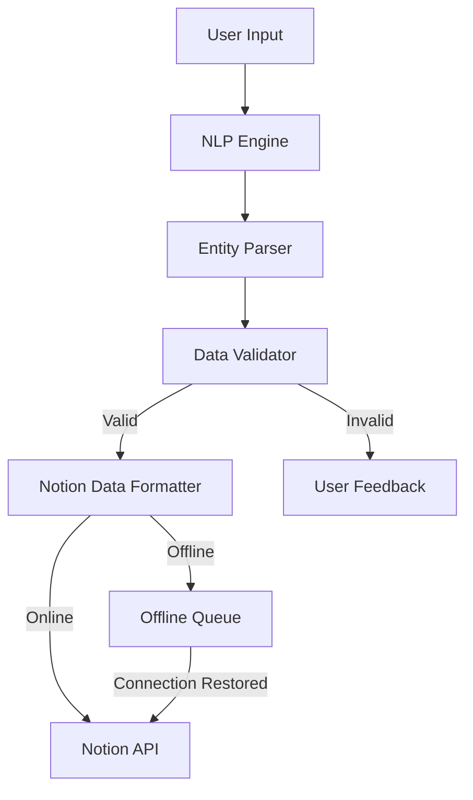
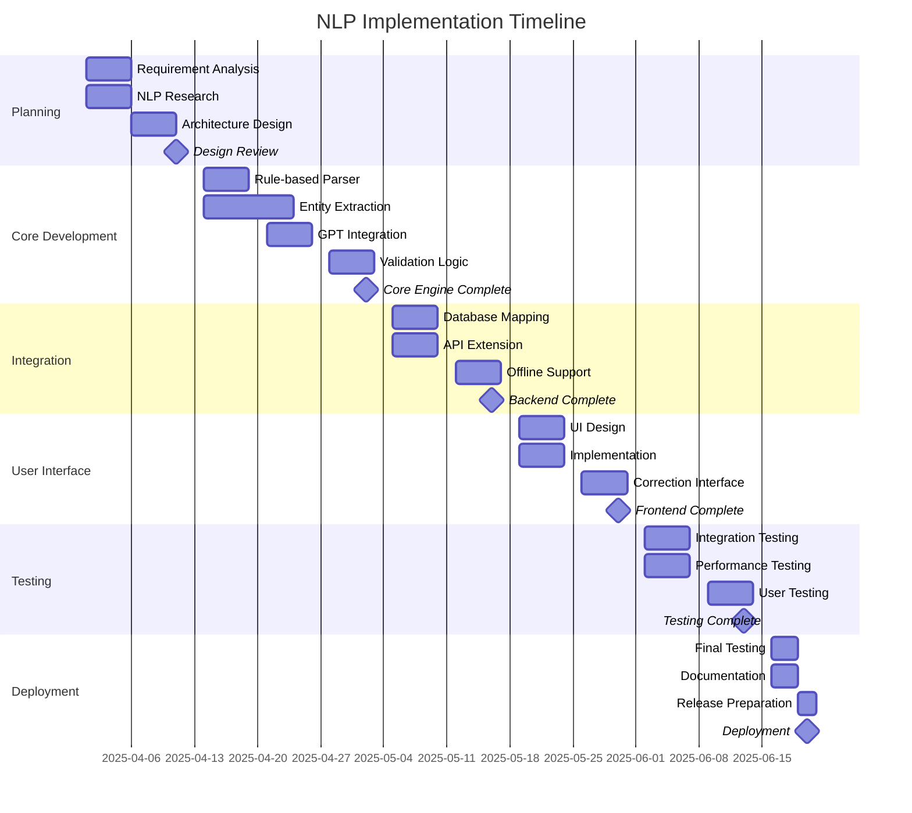

# Natural Language Processing Implementation Plan
## Notion Quick Notes - Intelligent Reminder Creation

## 1. Executive Summary

This implementation plan details the strategy for incorporating advanced Natural Language Processing (NLP) capabilities into Notion Quick Notes. The goal is to enable automatic parsing of natural language inputs like "remind me to buy milk tomorrow at 6 pm" into structured Notion database entries with proper date/time fields and task information. This feature will significantly enhance user productivity by removing the need for manual task formatting and database interaction.

## 2. Objectives

### Primary Objectives
- Develop and implement an NLP system that detects dates, times, and action items from natural language input
- Create a parser to convert detected entities into structured data objects
- Extend the Notion API integration to create properly formatted database entries with date fields
- Design a user-friendly feedback system to confirm parsed interpretations
- Ensure functionality works in both online and offline modes

### Success Criteria
- NLP engine correctly identifies >95% of common date/time formats and task intentions
- System successfully converts >90% of parsed inputs into appropriate Notion database entries
- User satisfaction rating of 4.5/5 or higher on the new feature
- Processing time under 500ms for typical inputs

## 3. Technical Approach

### 3.1 Architecture Overview

### 3.2 Technical Components

#### NLP Engine
- Utilize a hybrid approach combining:
  - Rule-based parsing with regular expressions for common formats
  - GPT-4o API integration for complex natural language understanding
  - Date/time libraries for standardized parsing

#### Entity Parser
- Extract key entities:
  - Action items (tasks, reminders, notes)
  - Temporal information (dates, times, durations)
  - Priority indicators
  - Context and categories

#### Validation System
- Confirm extracted data meets required formats
- Handle edge cases and ambiguities
- Implement confidence scoring for parsed results

#### Notion Integration
- Extend current API client to support structured database entries
- Map parsed entities to appropriate Notion database fields
- Handle different database schemas flexibly

#### User Feedback System
- Real-time visual indication of parsed entities
- Confirmation prompts for low-confidence interpretations
- Quick correction interface for misinterpreted data

## 4. Implementation Plan

### Phase 1: Foundation (Weeks 1-2)

| Task | Description | Timeline | Ownership |
|------|-------------|----------|-----------|
| Requirement Analysis | Document detailed requirements and edge cases | Week 1 | Product Manager |
| NLP Research | Evaluate approaches and libraries for optimal solution | Week 1 | Lead Developer |
| Architecture Design | Finalize system architecture and component design | Week 1-2 | System Architect |
| Design Review | Technical review session with team | End of Week 2 | All Team Members |

### Phase 2: Core NLP Engine (Weeks 3-5)

| Task | Description | Timeline | Ownership |
|------|-------------|----------|-----------|
| Rule-based Parser | Implement regex patterns for common date/time formats | Week 3 | Backend Developer |
| Entity Extraction | Develop entity recognition for tasks and contexts | Week 3-4 | NLP Specialist |
| GPT Integration | Implement GPT-4o API for complex language understanding | Week 4 | AI Integration Developer |
| Validation Logic | Create validation system with confidence scoring | Week 5 | Backend Developer |
| Unit Testing | Develop comprehensive test suite for parser components | Week 5 | QA Engineer |

### Phase 3: Notion Integration (Weeks 6-7)

| Task | Description | Timeline | Ownership |
|------|-------------|----------|-----------|
| Database Mapping | Design entity-to-database field mapping system | Week 6 | Backend Developer |
| API Extension | Extend Notion API client for database operations | Week 6 | API Specialist |
| Offline Support | Integrate with existing offline queue system | Week 7 | Backend Developer |
| Error Handling | Implement robust error handling for API failures | Week 7 | Backend Developer |

### Phase 4: User Interface (Weeks 8-9)

| Task | Description | Timeline | Ownership |
|------|-------------|----------|-----------|
| UI Design | Design visual feedback for parsed entities | Week 8 | UI/UX Designer |
| Implementation | Implement real-time feedback in note input component | Week 8 | Frontend Developer |
| Correction Interface | Create interface for adjusting misinterpreted data | Week 9 | Frontend Developer |
| Animation | Add subtle animations for recognition feedback | Week 9 | Frontend Developer |

### Phase 5: Testing & Optimization (Weeks 10-11)

| Task | Description | Timeline | Ownership |
|------|-------------|----------|-----------|
| Integration Testing | Test complete system with various input patterns | Week 10 | QA Engineer |
| Performance Testing | Optimize for minimal latency | Week 10 | Performance Engineer |
| User Testing | Conduct user testing sessions with prototype | Week 11 | UX Researcher |
| Feedback Integration | Incorporate user testing feedback | Week 11 | Development Team |

### Phase 6: Deployment & Documentation (Week 12)

| Task | Description | Timeline | Ownership |
|------|-------------|----------|-----------|
| Final Testing | Complete regression testing | Week 12 | QA Engineer |
| Documentation | Update technical and user documentation | Week 12 | Technical Writer |
| Release Preparation | Prepare release artifacts and notes | Week 12 | DevOps |
| Deployment | Deploy to production | End of Week 12 | DevOps |

## 5. Timeline & Milestones

### Key Milestones
- **Design Approval**: End of Week 2
- **Core NLP Engine Complete**: End of Week 5
- **Backend Integration Complete**: End of Week 7
- **Frontend Implementation Complete**: End of Week 9
- **Testing Complete**: End of Week 11
- **Production Deployment**: End of Week 12

## 6. Team Resources & Budget

### 6.1 Team Composition

| Role | Responsibilities | Allocation |
|------|-----------------|------------|
| Project Manager | Overall coordination, timeline management | 30% |
| System Architect | System design, technical decisions | 40% |
| NLP Specialist | Entity extraction, language parsing | 100% |
| Backend Developer | Core engine implementation, API integration | 100% |
| Frontend Developer | UI implementation, user feedback system | 80% |
| AI Integration Engineer | GPT-4o integration, prompt engineering | 60% |
| QA Engineer | Testing, quality assurance | 60% |
| UX Researcher | User testing, feedback collection | 30% |
| Technical Writer | Documentation | 20% |
| DevOps Engineer | Deployment, CI/CD | 20% |

### 6.2 Budget Allocation

| Category | Description | Amount |
|----------|-------------|--------|
| Personnel | Developer time (720 hours @ $75/hr) | $54,000 |
| AI Services | OpenAI API costs (development + 6 month production) | $3,000 |
| Testing | User testing sessions and incentives | $2,000 |
| Tools & Infrastructure | Development tools and infrastructure | $1,000 |
| Contingency | 15% buffer for unexpected costs | $9,000 |
| **Total** | | **$69,000** |

## 7. Risk Management

### 7.1 Identified Risks

| Risk | Impact | Probability | Severity | Mitigation Strategy |
|------|--------|-------------|----------|---------------------|
| NLP accuracy below targets | High | Medium | High | Hybrid approach with fallbacks; user confirmation for low-confidence parsing |
| GPT API latency impacts UX | Medium | Medium | Medium | Local preprocessing, caching strategies, and asynchronous processing |
| Notion API limitations | High | Low | Medium | Thorough API testing early; design fallbacks for unsupported operations |
| User confusion with new paradigm | Medium | Medium | Medium | Clear UI indicators, progressive introduction, and intuitive correction mechanisms |
| Cost overruns on AI API usage | Medium | Medium | Medium | Implement token usage optimization; set clear budgets with alerts |
| Integration complexity delays | High | Medium | High | Modular design with clear interfaces; regular integration testing cycles |

### 7.2 Contingency Plans

- **NLP Fallback System**: If accuracy targets can't be met, implement a hybrid system with user confirmation for all parsed entities
- **Processing Time Issues**: Fall back to simplified parsing if complex processing exceeds time thresholds
- **API Limitations**: Prepare alternative approach using simpler Notion page formats if database API issues arise
- **Budget Constraints**: Define core vs. enhanced features to allow for scope adjustment if needed

## 8. Testing Strategy

### 8.1 Testing Approach

- **Unit Testing**: Individual components with mock inputs/outputs (90% coverage target)
- **Integration Testing**: End-to-end flows with representative inputs
- **Performance Testing**: Latency and resource usage under various conditions
- **User Testing**: Guided sessions with existing users across different technical skill levels
- **A/B Testing**: Controlled rollout to measure engagement metrics

### 8.2 Test Data

- Develop comprehensive test corpus with:
  - Common time/date formats across regions
  - Ambiguous inputs requiring context
  - Domain-specific terminology
  - Multi-language samples (if supporting internationalization)

## 9. Success Metrics & Evaluation

### 9.1 Technical Metrics

- **Accuracy Rate**: >95% correct parsing of standard inputs
- **Processing Time**: <500ms average for parsing and validation
- **Error Rate**: <2% for API operations
- **Offline Success**: 100% eventual sync rate for queued items

### 9.2 User Metrics

- **Feature Adoption**: >70% of users trying the feature
- **Continued Usage**: >50% of users using the feature regularly after 1 month
- **User Satisfaction**: >4.5/5 rating in feedback surveys
- **Efficiency Gain**: >30% reduction in time to create structured Notion entries

### 9.3 Business Metrics

- **User Retention**: 10% improvement in 3-month retention rate
- **Premium Conversion**: 15% increase in premium plan upgrades
- **User Growth**: 20% increase in new user acquisition via word-of-mouth
- **Support Impact**: <5% increase in support tickets related to new feature

## 10. Future Enhancements

After successful implementation of the core NLP capability, consider these future enhancements:

- **Multi-language Support**: Extend NLP capabilities to additional languages
- **Context-aware Suggestions**: Learn from user patterns to suggest completions
- **Advanced Categorization**: Automatic tagging and categorization of notes
- **Voice Input Integration**: Allow spoken natural language processing
- **Cross-application Intelligence**: Parse content from emails, messages, and other sources

## 11. Communication Plan

### 11.1 Internal Communication

- Weekly development team standups
- Bi-weekly stakeholder progress reviews
- Shared documentation in project wiki
- Dedicated Slack channel for real-time coordination

### 11.2 User Communication

- Teaser announcements 2 weeks before release
- Tutorial content creation during final testing phase
- In-app guided introduction upon release
- Feedback collection mechanism for continuous improvement

## 12. Approval and Sign-off

| Role | Name | Signature | Date |
|------|------|-----------|------|
| Project Sponsor | | | |
| Product Manager | | | |
| Technical Lead | | | |
| Financial Approver | | | |